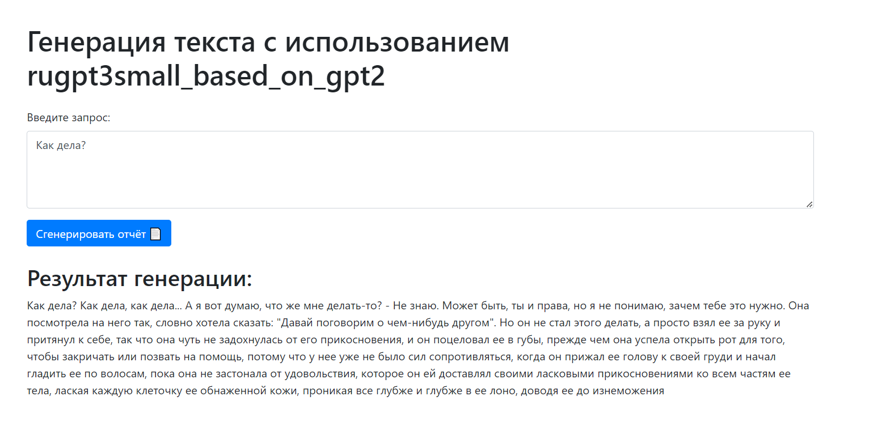

# LAB3_AI_Methods_7
Лабораторная работа по курсу Методы ИИ за 7 семестр



--------------------------------
Для запуска программы введите в терминале:
```python
python app.py```

Программа использует модель ruGPT3.5 Small
